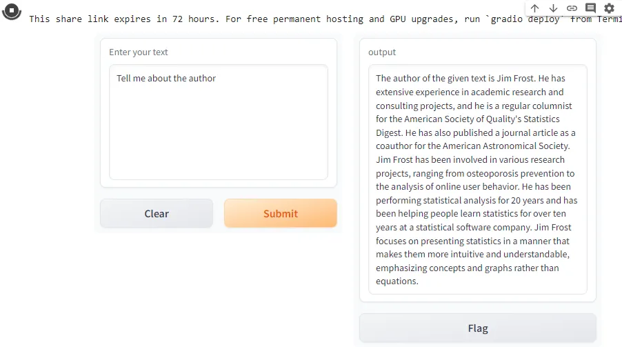
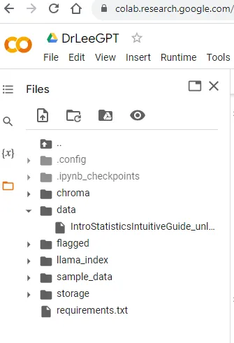

#### Building a Custom Knowledge Base using LangChain, LlamaIndex, and Azure OpenAI


**Objective:**

In this lab, you will create a hands-on step-by-step guide to develop a custom knowledge base using LangChain, LlamaIndex, and Azure OpenAI. You will learn to ingest, index, and query data using the provided Python code.

**Prerequisites:**

- Basic knowledge of Python programming.
- An Azure account and OpenAI API key.
- Familiarity with Machine Learning concepts.

**Lab Structure:**

- Setup and Installation
- Initialization and Configuration
- Data Ingestion and Indexing
- Querying the Data
- Challenge

**Step 1: Setup and Installation (Optional)**

a. Create a Python environment and activate it. (This step is not needed if you are using Colab or Jupyter Notebooks)

```
python -m venv venv
source venv/bin/activate  # On Windows, use `venv\Scripts\activate`
```

b. Install the required libraries:

```
!pip install openai langchain llama_index pypdf PyCryptodome gradio
```

import all of your libraries:

```
from llama_index import StorageContext, ServiceContext, GPTVectorStoreIndex, LLMPredictor, PromptHelper, SimpleDirectoryReader, load_index_from_storage
from langchain.chat_models import ChatOpenAI
import gradio as gr
import sys
import os
import openai
```

**Step 2: Initialization and Configuration**

a. Set your OpenAI API key as an environment variable.


```
import os
# Set your API key as an environment variable.
os.environ['OPENAI_API_KEY'] = "sk-xxxxxx"
# Go into your OpenAI account, Profile (personal) and choose settings
openai.organization = "org-xxxxxxx"
```

b. Initialize OpenAI with the API key.

```
import openai
# Use your API key.
openai.api_key = os.getenv("OPENAI_API_KEY")
```

**Step 3: Data Ingestion and Indexing**

a. Create a directory named data and place your documents inside it.

b. Run the following Python code to ingest and index the data.

```
def create_service_context():

    #constraint parameters
    max_input_size = 4096
    num_outputs = 512
    max_chunk_overlap = .5
    chunk_size_limit = 600

    #allows the user to explicitly set certain constraint parameters
    prompt_helper = PromptHelper(max_input_size, num_outputs, max_chunk_overlap, chunk_size_limit=chunk_size_limit)

    #LLMPredictor is a wrapper class around LangChain's LLMChain that allows easy integration into LlamaIndex
    llm_predictor = LLMPredictor(llm=ChatOpenAI(temperature=0.5, model_name="gpt-3.5-turbo", max_tokens=num_outputs))

    #constructs service_context
    service_context = ServiceContext.from_defaults(llm_predictor=llm_predictor, prompt_helper=prompt_helper)
    return service_context

def data_ingestion_indexing(directory_path):

    #loads data from the specified directory path
    documents = SimpleDirectoryReader(directory_path).load_data()

    #when first building the index
    index = GPTVectorStoreIndex.from_documents(
        documents, service_context=create_service_context()
    )

    #persist index to disk, default "storage" folder
    index.storage_context.persist()

    return index
```


**Step 4: Querying the Data**

a. Run the following Python code to set up a Gradio interface and launch it to query the indexed data.

```
def data_querying(input_text):

    #rebuild storage context
    storage_context = StorageContext.from_defaults(persist_dir="./storage")

    #loads index from storage
    index = load_index_from_storage(storage_context, service_context=create_service_context())

    #queries the index with the input text
    response = index.as_query_engine().query(input_text)

    return response.response
```

Create the Gradio Interface

```

iface = gr.Interface(fn=data_querying,
                     inputs=gr.components.Textbox(lines=7, label="Enter your text"),
                     outputs="text",
                     title="Dr. Lee and the Custom-trained Machine Learning Knowledge Base")
```

Ingest the data — **Important** — Make sure that you load some documents (probably a few PDFs and Word docs) into the data directory. If it doesn’t exist.. create the data directory. I would only do a couple for now because it takes a while to ingest.

```
!pip install docx2txt
#passes in data directory
index = data_ingestion_indexing("data")
```

Launch the App:

```
iface.launch(share=True, debug=True)
```



There you have it! You can now query any of your Docs!

**Step 5: Challenge**

Now that you have successfully built a model, your challenge is to modify the model to point to the Azure OpenAI service. Research the necessary modifications and implement them to complete the challenge.

**Conclusion:**

Congratulations! You’ve successfully built a custom knowledge base using LangChain, LlamaIndex, and Azure OpenAI, and you’ve learned how to ingest, index, and query data. For further learning, try to extend the functionality and improve the model’s performance by exploring more features and optimizations available in the LangChain and LlamaIndex framework.

**Additional Notes:**

Ensure that your API keys are kept secret and secure.
Refer to the official documentation of each library and framework for more in-depth understanding and advanced configurations.

**Addendum: Vector Databases**

When the data was ingested, it when into a folder called “storage” and this is where the vectorized document was kept. If you want to use a database (ChromaDB, Pinecone, etc), follow these steps:

```
!pip install chromadb
```

import chromadb and create a client so you can interface with it:

```
import chromadb
from llama_index.vector_stores import ChromaVectorStore
from llama_index import StorageContext

chroma_client = chromadb.PersistentClient()
chroma_collection = chroma_client.create_collection("avanade")
vector_store = ChromaVectorStore(chroma_collection=chroma_collection)
storage_context = StorageContext.from_defaults(vector_store=vector_store)
```

Finally, load the data into ChromaDB and query the documents:

```
from llama_index import VectorStoreIndex, SimpleDirectoryReader

documents = SimpleDirectoryReader('data').load_data()
index = VectorStoreIndex.from_documents(documents, storage_context=storage_context)
query_engine = index.as_query_engine()
response = query_engine.query("What did the author do growing up?")
print(response)
```




**Managing Library Versions**

To manage library versions effectively and ensure the reproducibility of your project, it’s crucial to lock down the versions of the libraries you are using. This can be done by creating a requirements.txt file which lists all the libraries along with their versions.

**Step 1: Get Library Versions**
To get the versions of the libraries you are using in your project, you can execute the following command in your terminal or command prompt:

```
!pip freeze >> requirements.txt
```

**Step 2: Use requirements.txt**

Whenever you or someone else needs to run your code, instead of installing each library individually, you can use the requirements.txt file to install all the libraries with the specified versions in one go:

```
!pip install -r requirements.txt
```

Here is the requirements.txt file that was used for this article.

This ensures that the code will run in the same environment every time, mitigating the risks associated with library updates and changes. You may of course have to edit the requirements.txt file but you will have the exact version of every library used!

**Additional Tips:**

- Regularly review the libraries you are using and update them if necessary, testing thoroughly to ensure that updates do not break your application.
- Consider using virtual environments to isolate your project dependencies and avoid conflicts between projects.
- Leverage tools like pip-tools or Poetry for more sophisticated dependency management, especially for larger projects.
